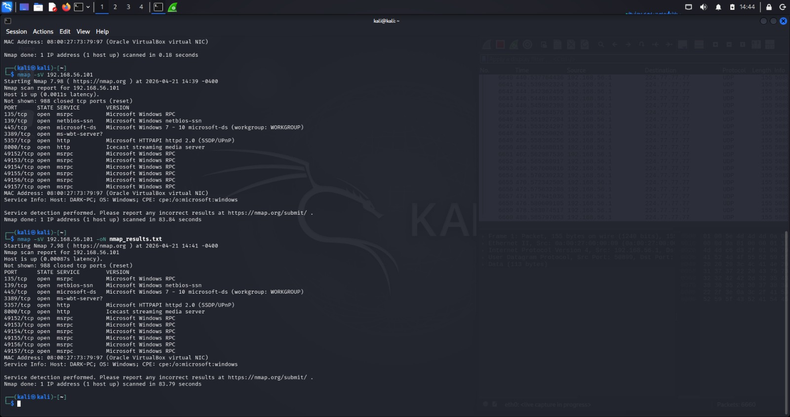
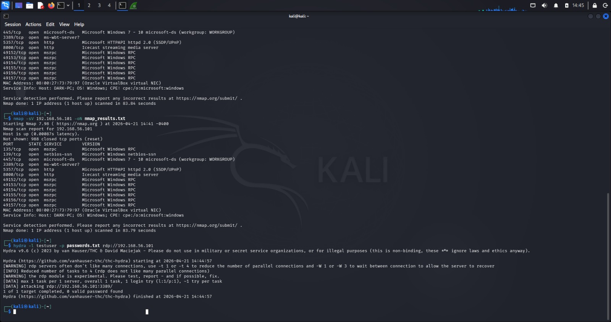

# Mini-soc-lab : Detect & Investigate an Attack Using Kali Linux

> A controlled cybersecurity lab project that simulates realistic attacker behavior and demonstrates how incident responders detect, analyze, and document security incidents

----------------------------------------------------------------------

##  Project Overview
**Course:** BFOR611 Incident Handling  
**Institution:** University at Albany SUNY  
**Professor:** Prof. Vinicius Lima  
**Team Members:** Nithin Sridasyam and Atharva Shigvan

The **Mini SOC Lab** project bridges the gap between offensive security techniques and defensive incident handling practices. By building a controlled attack/defense environment, we simulate real-world cybersecurity threats to facilitate the collection of forensic evidence and the completion of full incident response documentation

## Project Tools
* **Nmap:** Essential for the **Identification** phase of the IR lifecycle. It allows responders to view the network from an attacker's perspective, discovering unauthorized open ports and services.
* **Hydra:** A high-speed, industry-standard tool used to simulate **Brute-Force** authentication attacks It is critical for testing account lockout policies and generating the specific artifacts needed for defensive testing
* **Wireshark:** A cornerstone of **Analysis** . It captures raw packet data during an attack, providing a detailed record of communication that allows analysts to correlate network-level evidence with host-level logs.
* **Windows Event Viewer:** Vital for **Detection** and **Evidence Collection** . It provides the forensic "fingerprints" of an attack, specifically through security logs like Event ID 4625 (Audit Failure)

##  Lab Architecture & Methodology
The lab environment was constructed using **Oracle VirtualBox** to ensure a secure, isolated virtualization layer.
 
### Setup and Environment
* **Hypervisor:** VirtualBox 7.2.8 with the Extension Pack for enhanced compatibility.
* **Network:** **Host-Only Adapter** . This creates a secure, isolated "sandbox" that prevents attack traffic from escaping the lab and interfering with external internet services or the home network.
* **Attacker (Kali Linux 2026.1):** A Debian-based distro designed for digital forensics and penetration testing. It was allocated 2GB RAM and 2 CPU cores to ensure smooth performance.
* **Victim (Windows OS):** A software-based emulation of the Windows OS . Remote Desktop (RDP) was enabled as the primary attack vector.
 
### Workflow Process
1.  **Preparation:** Configured the Windows **Audit Policy** to track both "Success" and "Failure" for logon events.
2.  **Connectivity:** Verified communication between VMs using the `ping` command.
3.  **Simulation:** Executed reconnaissance and brute-force phases from the Kali machine.
4.  **Analysis:** Captured live traffic in Wireshark and analyzed Security Logs in Event Viewer.
 
 
##  Attack Simulation Results
 
### Phase 1: Reconnaissance (Nmap)
We performed a service version scan (`nmap -sV`) against the target IP **192.168.56.101**.
* **Discovery:** Port **3389 (RDP)**, **445 (SMB)**, and various **RPC** ports were confirmed as active and reachable on the Windows machine.

 
### Phase 2: Brute Force (Hydra)
We executed a targeted brute-force attack against the RDP service (port 3389). Using **Hydra**, we attempted to crack the password for the `testuser` account using a custom `passwords.txt` list.

 
## Evidence Collection & Findings
 
### Network Evidence (Wireshark)
Live packet capture during the attack revealed critical indicators:
* A high volume of **TCP SYN/ACK/RST** packets on port 3389.
* Significant **RDP traffic spikes** that correlated exactly with the timing of the brute-force execution.

 
### Host-Based Evidence (Event Logs)
Analysis of the Windows Security Logs provided definitive proof of the attack:
* **19 filtered security events** were identified during the simulation window.
* **Event ID 4625 (Audit Failure):** Confirmed multiple accounts failed to log on, with logs indicating the attempts originated from the network.

 
## Indicators of Compromise (IOCs)
 
| IOC Type | Value | Description | Recommended Action |
| :--- | :--- | :--- | :--- |
| **Source IP** | 192.168.56.102 | Attacker machine (Kali Linux) | Block / Monitor |
| **Target IP** | 192.168.56.101 | Victim Machine (Windows 7) | Harden |
| **Port** | 3389 | RDP service targeted | Restrict |
| **Event ID** | 4625 | Failed Login attempts | Alerts |
 
 
##  Response & Mitigation Plan
Based on the successful simulation, we developed a multi-layered mitigation strategy:
* **Isolation:** Immediately isolate the compromised or targeted host from the internal network to prevent lateral movement.
* **Access Control:** Enforce strong password requirements and implement **Multi-Factor Authentication (MFA)**.
* **RDP Hardening:** Disable RDP if not required; if necessary, restrict access to trusted IPs and change the default port (3389) to a non-standard port.
* **Policy Enforcement:** Implement **Account Lockout Policies** to stop infinite brute-force attempts.
* **Monitoring:** Deploy a **SIEM** (Security Information and Event Management) system to trigger alerts on repeated Event ID 4625 occurrences.
